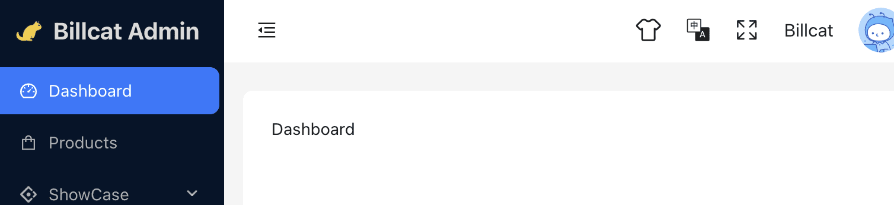

# React.js ant design starter

This is a work in progress.

I will create `react2025-ant-design-starter` next year, hence use `react2024` in the name.



1. Vite5/TypeScript
2. React 18
3. React Router 6
4. Ant Design 5.16
5. Mobx react lite
6. OpenID Connect ([react-oidc-context](https://github.com/authts/react-oidc-context))

## Up and running

```shell
cd react2024-ant-design-starter
pnpm install
pnpm run dev
```

## Issues and comments

Leave your comments and suggestions in the issues area. For example, if you want a slightly different tech stack.

Also, if you like my demo, ~~please consider buying me a coffee~~. Please follow and star :).

## License

[MIT](./LICENSE)
